# Structure Detection Flow

This document illustrates the flow of structure detection in the analyzer package, showing how `analyze()` calls `analyzeStructure()` and its internal components.

## Overview

The structure detection process analyzes project directory structure to detect:
- Entry points (where execution starts)
- Test locations (where tests live)
- Architecture pattern (layered, domain-driven, microservices, etc.)
- Directory tree (ASCII representation)
- Configuration files

## Flow Diagram

```mermaid
flowchart TD
    Start([analyze called]) --> CheckSkip{skipStructure<br/>option?}

    CheckSkip -->|true| SkipStructure[Skip structure analysis]
    CheckSkip -->|false| CallAnalyzeStructure[Call analyzeStructure]

    SkipStructure --> MergeUndefined[structure = undefined]

    CallAnalyzeStructure --> Step1[Step 1: findEntryPoints]

    Step1 --> EP_Framework{Framework-specific<br/>shortcuts?}
    EP_Framework -->|Django| EP_Django[Check manage.py]
    EP_Framework -->|NestJS| EP_Nest[Check src/main.ts]
    EP_Framework -->|FastAPI| EP_Fast[Check app/main.py]
    EP_Framework -->|Flask| EP_Flask[Check app.py]
    EP_Framework -->|Next.js| EP_Next[Check app/layout.tsx<br/>or pages/_app.tsx]
    EP_Framework -->|Other| EP_PackageJson{Node project?}

    EP_Django --> EP_Result[EntryPointResult]
    EP_Nest --> EP_Result
    EP_Fast --> EP_Result
    EP_Flask --> EP_Result
    EP_Next --> EP_Result

    EP_PackageJson -->|Yes| EP_ParsePkg[Parse package.json<br/>main/exports field]
    EP_PackageJson -->|No| EP_Priority[Check priority patterns<br/>by project type]

    EP_ParsePkg --> EP_Result
    EP_Priority --> EP_Glob{Glob pattern?}
    EP_Glob -->|Yes| EP_GlobMatch[Match cmd/*/main.go, etc.]
    EP_Glob -->|No| EP_FileCheck[Check file exists]

    EP_GlobMatch --> EP_Result
    EP_FileCheck --> EP_Result

    EP_Result --> Step2[Step 2: findTestLocations]

    Step2 --> Test_Type{Project type?}
    Test_Type -->|Python| Test_Pytest[Check tests/ or test/<br/>Check pytest.ini]
    Test_Type -->|Node| Test_Jest[Check __tests__/<br/>Check jest/vitest config]
    Test_Type -->|Go| Test_Go[Return *_test.go pattern]
    Test_Type -->|Rust| Test_Rust[Check tests/ directory]

    Test_Pytest --> Test_Result[TestLocationResult]
    Test_Jest --> Test_Result
    Test_Go --> Test_Result
    Test_Rust --> Test_Result

    Test_Result --> Step3[Step 3: walkDirectories<br/>max depth: 4]

    Step3 --> Walk_Scan[Scan directory tree<br/>excluding node_modules,<br/>.git, etc.]
    Walk_Scan --> Walk_List[List of directories]

    Walk_List --> Step4[Step 4: classifyArchitecture]

    Step4 --> Arch_Check1{Microservices?}
    Arch_Check1 -->|Yes| Arch_Micro[Check services/*, apps/*,<br/>cmd/* patterns<br/>Need 2+ services]
    Arch_Check1 -->|No| Arch_Check2{Domain-driven?}

    Arch_Micro --> Arch_Result[ArchitectureResult]

    Arch_Check2 -->|Yes| Arch_DDD[Check features/*, modules/*,<br/>contexts/* patterns<br/>NestJS special case]
    Arch_Check2 -->|No| Arch_Check3{Layered?}

    Arch_DDD --> Arch_Result

    Arch_Check3 -->|Yes| Arch_Layered[Check models/, services/,<br/>api/controllers/ patterns]
    Arch_Check3 -->|No| Arch_Check4{Library?}

    Arch_Layered --> Arch_Result

    Arch_Check4 -->|Yes| Arch_Library[No entry points +<br/>lib/ or pkg/ present]
    Arch_Check4 -->|No| Arch_Monolith[Default: Monolith]

    Arch_Library --> Arch_Result
    Arch_Monolith --> Arch_Result

    Arch_Result --> Step5[Step 5: buildAsciiTree<br/>max depth: 4, max dirs: 40]

    Step5 --> Tree_Sort[Sort directories<br/>Priority: src, lib, app,<br/>tests, docs]
    Tree_Sort --> Tree_Format[Format as ASCII tree<br/>with indentation]
    Tree_Format --> Tree_Result[ASCII tree string]

    Tree_Result --> Step6[Step 6: findConfigFiles]

    Step6 --> Config_Common[Check common configs<br/>.env, .gitignore, README]
    Config_Common --> Config_Type{Project type?}

    Config_Type -->|Node| Config_Node[+ tsconfig.json, package.json,<br/>eslint.config.mjs, etc.]
    Config_Type -->|Python| Config_Python[+ pyproject.toml, requirements.txt,<br/>pytest.ini, etc.]
    Config_Type -->|Go| Config_Go[+ go.mod, go.sum,<br/>.golangci.yml]
    Config_Type -->|Rust| Config_Rust[+ Cargo.toml, Cargo.lock,<br/>rust-toolchain.toml]

    Config_Node --> Config_Result[Array of config files]
    Config_Python --> Config_Result
    Config_Go --> Config_Result
    Config_Rust --> Config_Result

    Config_Result --> Step7[Step 7: Map directories<br/>to purposes]

    Step7 --> Map_Lookup[Lookup basename in<br/>DIRECTORY_PURPOSES map]
    Map_Lookup --> Map_Result[Directory purposes object]

    Map_Result --> Step8[Step 8: Calculate confidence]

    Step8 --> Conf_Calc[Weighted average:<br/>Entry points: 50%<br/>Test location: 25%<br/>Architecture: 25%]
    Conf_Calc --> Conf_Result[Overall confidence score]

    Conf_Result --> BuildResult[Build StructureAnalysis object]

    BuildResult --> MergeResult[Merge into AnalysisResult.structure]
    MergeUndefined --> FinalResult[Return AnalysisResult]
    MergeResult --> FinalResult

    FinalResult --> End([Analysis complete])

    style Start fill:#e1f5ff
    style End fill:#e1f5ff
    style CheckSkip fill:#fff4e1
    style EP_Framework fill:#fff4e1
    style EP_PackageJson fill:#fff4e1
    style EP_Glob fill:#fff4e1
    style Test_Type fill:#fff4e1
    style Arch_Check1 fill:#fff4e1
    style Arch_Check2 fill:#fff4e1
    style Arch_Check3 fill:#fff4e1
    style Arch_Check4 fill:#fff4e1
    style Config_Type fill:#fff4e1
    style Step1 fill:#f0e1ff
    style Step2 fill:#f0e1ff
    style Step3 fill:#f0e1ff
    style Step4 fill:#f0e1ff
    style Step5 fill:#f0e1ff
    style Step6 fill:#f0e1ff
    style Step7 fill:#f0e1ff
    style Step8 fill:#f0e1ff
    style MergeResult fill:#d4edda
    style BuildResult fill:#d4edda
    style FinalResult fill:#d4edda
```



## Component Details

### 1. findEntryPoints
**Location:** `/packages/analyzer/src/analyzers/structure.ts:441`

Detects where code execution starts using:
- Framework-specific shortcuts (Django: `manage.py`, NestJS: `src/main.ts`, etc.)
- package.json parsing (`main`, `exports` fields) for Node projects
- Priority-ordered pattern matching per project type
- Glob pattern support for Go microservices (`cmd/*/main.go`)

**Returns:** `EntryPointResult` with entry points array, confidence score, and source.

### 2. findTestLocations
**Location:** `/packages/analyzer/src/analyzers/structure.ts:821`

Detects test framework and locations:
- **Python:** pytest (`tests/`, `test/`, `pytest.ini`)
- **Node:** Jest/Vitest (`__tests__/`, `*.test.ts`, config files)
- **Go:** go test (`*_test.go` colocated pattern)
- **Rust:** cargo test (`tests/` directory)

**Returns:** `TestLocationResult` with test locations, confidence, and framework name.

### 3. walkDirectories
**Location:** `/packages/analyzer/src/utils/directory.ts`

Recursively walks project directory tree:
- Maximum depth: 4 levels (configurable)
- Excludes: `node_modules`, `.git`, `dist`, `build`, `.next`, etc.
- Returns array of relative directory paths

**Returns:** `string[]` of directory paths.

### 4. classifyArchitecture
**Location:** `/packages/analyzer/src/analyzers/structure.ts:656`

Classifies project architecture pattern (priority order):
1. **Microservices:** Multiple services (`services/*`, `apps/*`, `cmd/*` with 2+ instances)
2. **Domain-driven:** Feature modules (`features/*`, `modules/*`, NestJS modules)
3. **Layered:** Traditional layers (`models/`, `services/`, `api/`)
4. **Library:** No entry point + `lib/` or `pkg/` directory
5. **Monolith:** Default fallback

**Returns:** `ArchitectureResult` with architecture type, confidence, and indicators.

### 5. buildAsciiTree
**Location:** `/packages/analyzer/src/analyzers/structure.ts:857`

Generates ASCII directory tree:
- Maximum depth: 4 levels
- Maximum directories: 40 (with "... N more" indicator)
- Priority sorting: `src`, `lib`, `app`, `tests`, `docs` first
- Clean indentation for context files

**Returns:** `string` (ASCII tree representation).

### 6. findConfigFiles
**Location:** `/packages/analyzer/src/analyzers/structure.ts:908`

Finds configuration files:
- **Common:** `.env`, `.gitignore`, `README.md`, `LICENSE`
- **Node:** `tsconfig.json`, `package.json`, `eslint.config.mjs`, `vite.config.ts`, etc.
- **Python:** `pyproject.toml`, `requirements.txt`, `pytest.ini`, `setup.py`, etc.
- **Go:** `go.mod`, `go.sum`, `.golangci.yml`
- **Rust:** `Cargo.toml`, `Cargo.lock`, `rust-toolchain.toml`

**Returns:** `string[]` of found config file paths.

## Confidence Calculation

The overall structure confidence is a weighted average:

```typescript
overallConfidence = (
  entryPointResult.confidence * 0.50 +
  testLocationResult.confidence * 0.25 +
  architectureResult.confidence * 0.25
)
```

**Rationale:**
- Entry points (50%): Most critical for understanding project execution
- Test locations (25%): Important for development workflow
- Architecture (25%): Helpful for understanding organization

## StructureAnalysis Result

The final `StructureAnalysis` object includes:

```typescript
{
  directories: Record<string, string>,     // path -> purpose mapping
  entryPoints: string[],                   // detected entry points
  testLocation: string | null,             // primary test location
  architecture: ArchitectureType,          // classified pattern
  directoryTree: string,                   // ASCII tree
  configFiles: string[],                   // found config files
  confidence: {
    entryPoints: number,                   // 0.0-1.0
    testLocation: number,                  // 0.0-1.0
    architecture: number,                  // 0.0-1.0
    overall: number,                       // weighted average
  }
}
```

## Integration with analyze()

The `analyzeStructure()` function is called from `analyze()` in `/packages/analyzer/src/index.ts:128`:

```typescript
const structure = options.skipStructure
  ? undefined
  : await analyzeStructure(rootPath, projectTypeResult.type, frameworkResult.framework);
```

If `skipStructure` is `true`, structure analysis is skipped entirely and `structure` field is `undefined` in the result.

## Error Handling

If any step in structure analysis fails, the function returns an empty structure analysis via `createEmptyStructureAnalysis()` (line 419):

```typescript
{
  directories: {},
  entryPoints: [],
  testLocation: null,
  architecture: 'monolith',
  directoryTree: '',
  configFiles: [],
  confidence: {
    entryPoints: 0.0,
    testLocation: 0.0,
    architecture: 0.0,
    overall: 0.0,
  }
}
```

## References

- **Source file:** `/packages/analyzer/src/analyzers/structure.ts`
- **Main entry:** `/packages/analyzer/src/index.ts`
- **Types:** `/packages/analyzer/src/types/structure.ts`
- **Utilities:** `/packages/analyzer/src/utils/directory.ts`, `/packages/analyzer/src/utils/file.ts`
